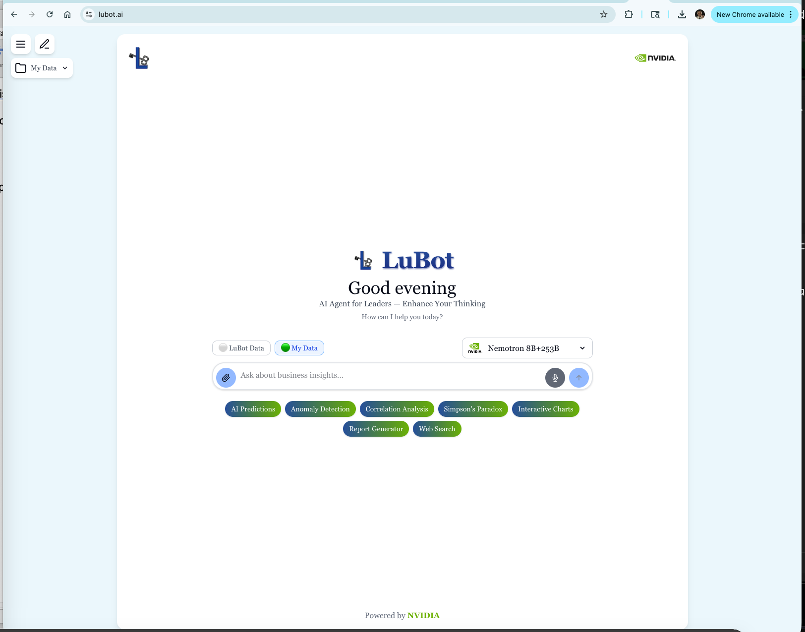
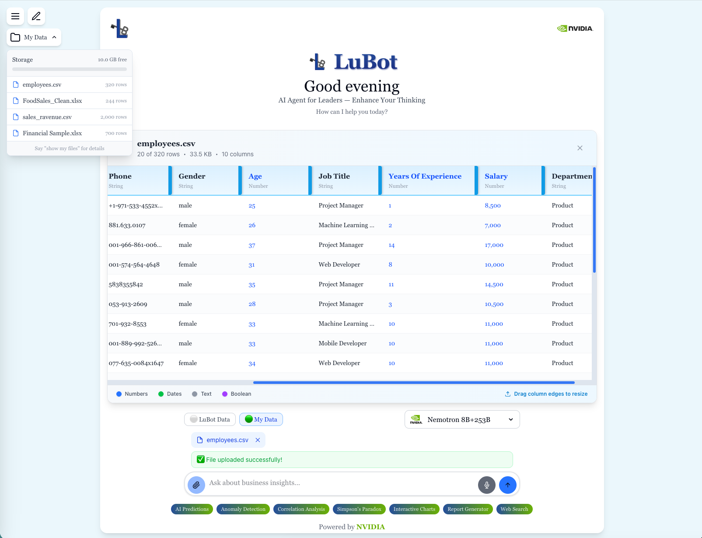
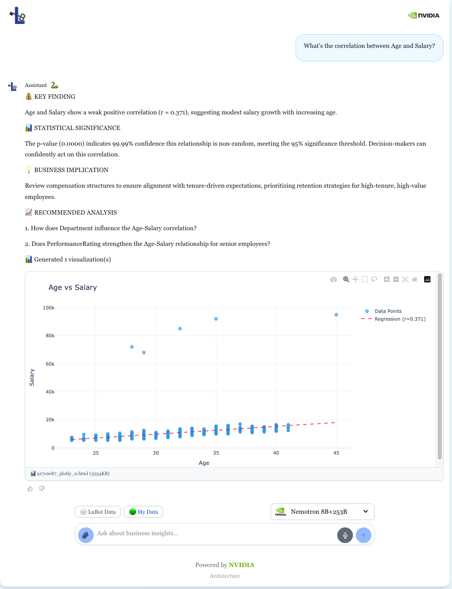
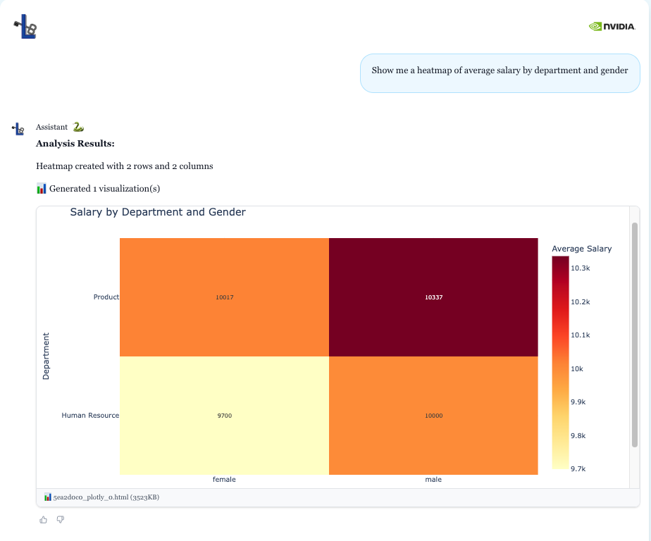

<p align="center">
  
  &nbsp;&nbsp;&nbsp;&nbsp;&nbsp;&nbsp;&nbsp;&nbsp;&nbsp;&nbsp;&nbsp;&nbsp;&nbsp;&nbsp;&nbsp;
  
</p>

<h2 align="center">LuBot NVIDIA Routing</h2>

<p align="center"><i>I built LuBot alone, from zero, over the last 8 months. This is the NVIDIA brain that powers it.</i></p>

> **📺 [Watch the 4-minute demo video](https://REPLACE_WITH_VIDEO_LINK)** — Upload data, ask questions, get PhD-level analysis in seconds.

**[lubot.ai](https://lubot.ai)** is live right now. Real users, real data, real NVIDIA API calls. Not a hackathon prototype.



---

## What is LuBot and why I built it

Big consulting companies and hedge funds charge thousands of dollars to look at your business data and tell you what actually matters. Most small and medium businesses cant afford that. They sit on millions of records from their customers and have no way to figure out what those numbers are really saying.

I built LuBot to change that.

LuBot is an AI-powered business analytics platform that helps real businesses make smarter decisions. You upload your data - CSV, Excel, whatever you have - ask questions in plain English, and get back real statistical analysis. Not just pretty charts. Real math. Correlation analysis, Simpson's Paradox detection, market concentration (HHI), anomaly detection, forecasting. The kind of stuff that a PhD data scientist at McKinsey would give you, but in language that a CEO can actually understand and act on.

Is it perfect? Not yet. I'm still developing it and it wont answer every question 100% accurate. But it's getting better every single day - literally, because it learns from every interaction. And my goal is clear: make LuBot as good as the best consulting companies out there, but at a fraction of the cost. So businesses with less revenue who cant pay thousands for advice can still get the same quality insights.

LuBot is designed for profitable businesses. This is not a toy. You get real math and statistics delivered straight to you in the chat interface, or you can generate PDF reports with all the insights. You can build interactive charts, visualize your data flow, save those charts and share them with your partners.

**Try it yourself at [lubot.ai](https://lubot.ai)** - upload your data and start asking questions.



### The self-learning system (this is the part nobody else has)

One of the most unique features is that LuBot has a self-learning RAG system that retrieves insights from your interactions and data patterns that you cant see by eye. Its something that works behind the scenes - you dont have direct access to it, but LuBot uses it to become smarter over time. The more you use it, the more it remembers about your business, your preferences, your needs. Over time LuBot becomes your best partner that knows everything about your business and is always ready to answer your deep questions.

### Privacy is not optional

LuBot never mixes user data. Never shares data between users. Everything is private and only you can access your data. Anytime you want you can delete everything. And if you need full control over your data - LuBot can run exclusively for your enterprise on your own infrastructure using NVIDIA Nemotron-3-Nano-30B as the local model, so nothing ever leaves your network. The live version at [lubot.ai](https://lubot.ai) is there for you to try it out and see what it can do.

### Predictions based on math, not hallucinations

LuBot can give you pretty accurate predictions about your business based on the data you give it. Everything is grounded in math and statistics - no hallucinations. The database schema is also designed smart, with hot storage (Neon PostgreSQL) and cold storage (Backblaze B2) across 34 tables and more than 450 columns. This is the foundation of how LuBot gets smarter over time - more data, more power, better outcomes. Plus 22 scheduled cron jobs running daily so it never misses important data.

---

## So what is this repo?

The full LuBot system is 112,000+ lines of code. I'm not open sourcing all of it - thats my business.

This repo contains just the **NVIDIA routing layer** - the part that decides which NVIDIA model to call, how to classify what the user wants, and how to handle failures. Every file in here uses NVIDIA technology. This is the brain that makes the smart decisions.

If you want to see it all working together - **go to [lubot.ai](https://lubot.ai)**, upload some data, and ask questions. Thats where you see the full experience.

If you want to look under the hood at how the NVIDIA routing works, keep reading.

---

## How the routing works

```
User asks a question
        |
        v
 Intent Classifier (4 tiers - cheapest method first)
 |-- Tier 0: Keywords like "correlation", "HHI"   --> instant, 0ms, free
 |-- Tier 1: Regex patterns                        --> 80% of queries caught here
 |-- Tier 2: NVIDIA Embeddings (semantic match)    --> 5ms for ambiguous stuff
 |-- Tier 3: NVIDIA Nano 8B LLM                    --> only ~5% need this
        |
        v
 Response Tier Router
 |-- Simple ("how many employees?")     --> direct answer, skip the LLM
 |-- Medium ("revenue by region")       --> Nano 8B adds insight
 |-- PhD level ("correlation X vs Y")   --> Ultra 253B full statistical analysis
        |
        v
 LLM Router (Netflix-style failover)
 |-- NVIDIA first (every single request, always)
 |-- Groq fallback (only when NVIDIA is actually down, ~1% of time)
        |
        v
 User gets their answer
```





The key idea: **not every question needs 253 billion parameters**. "How many employees do we have?" doesnt need a massive model. But "whats the correlation between marketing spend and customer retention across segments" - yeah, thats when you bring in the Ultra 253B. Use the right tool for the right job.

---

## NVIDIA technologies I use

| What | Model | Why |
|---|---|---|
| **Nemotron Nano 8B** | `nvidia/llama-3.1-nemotron-nano-8b-v1` | Fast, handles most queries. Intent classification and simple analysis. |
| **Nemotron Ultra 253B** | `nvidia/llama-3.1-nemotron-ultra-253b-v1` | The heavy hitter. 253B parameters for PhD-level statistical analysis when it actually matters. |
| **NV-EmbedQA-E5-v5** | `nvidia/nv-embedqa-e5-v5` | 1024-dim embeddings for semantic intent matching. Replaced Microsoft MiniLM with this - better for Q&A. |
| **NIM API** | `integrate.api.nvidia.com/v1` | All inference goes through NVIDIA. OpenAI-compatible so integration was clean. |
| **AdalFlow** | Framework | NVIDIA-optimized LLM orchestration. My LLMRouterClient adapts everything to work with it. |
| **Nemotron-3-Nano-30B** | On-premise option | For enterprise deployments where data cant leave the network. |

---

## Infrastructure

| Component | Technology |
|-----------|------------|
| **Server** | Hetzner Cloud US (Docker containers) |
| **Hot Storage** | Neon PostgreSQL (34 tables, 450+ columns) |
| **Cold Storage** | Backblaze B2 |
| **Response Time** | 8-10 seconds (first query), 8 seconds (warm) |
| **Batch Workers** | 22 daily cron jobs for self-learning |

---

## See it in action

**The best way to understand LuBot is to try it: [lubot.ai](https://lubot.ai)**

Upload a CSV or Excel file, ask questions about your data, and watch it route through the NVIDIA models in real time. You'll see direct answers for simple questions, enhanced analysis for medium ones, and full PhD-level statistical breakdowns for complex queries.

If you want to explore the routing code itself:

```bash
git clone https://github.com/lubobali/LuBot-NVIDIA-AI-Agent.git
cd LuBot-NVIDIA-AI-Agent
pip install -r requirements.txt
export NVIDIA_API_KEY="nvapi-your-key-here"  # free at https://build.nvidia.com
python demo/quickstart.py
```

The demo runs through all components - intent classification, response tier routing, and NVIDIA model calls. Even without an API key the intent classifier and response router work offline.

---

## What I'm most proud of technically

**The 4-tier intent cascade.** Most AI apps send every user message to an LLM just to figure out what the user wants. Thats slow and expensive. I built a cascade:

1. If someone says "correlation" - I know its a data query. No LLM needed. 0ms.
2. "Hello" is a greeting. Dont need a neural network for that. Regex catches 80% of queries.
3. Ambiguous stuff gets checked with NVIDIA Embeddings against canonical examples. 5ms.
4. Only truly confusing queries (~5%) actually go to the Nano 8B for classification.

**The Netflix failover.** NVIDIA gets tried on every request. Its not "sometimes NVIDIA, sometimes Groq." NVIDIA is always primary. Groq is the safety net for infrastructure issues only. And the fallback is smart - it only triggers on timeouts and 503s, not on content errors that would fail the same way on Groq anyway.

**The response tier routing.** "How many employees?" doesnt need PhD analysis. The system detects its a simple COUNT with 1 row and returns "You have 320 employees" directly. Only complex queries like correlation analysis get routed to Ultra 253B.

---

## Files in this repo

```
nvidia_routing/
  llm_router.py            - Main router. NVIDIA primary, Groq fallback, smart error handling.
  nvidia_client.py          - Clean NVIDIA API wrapper. Pick a model, send messages, get response.
  nvidia_embeddings.py      - NVIDIA embeddings. SentenceTransformer-compatible drop-in.
  llm_router_client.py      - Adapter that makes the router work with AdalFlow Generator.
  response_tier_router.py   - Decides: direct answer vs enhanced vs full PhD analysis.

intent_routing/
  intent_classifier.py      - The 4-tier classification cascade. Brains of the routing.
  correlation_detector.py   - Deterministic PhD query detection. Keywords before LLM, always.

demo/
  quickstart.py             - Run this first. All components working together.
  sample_queries.py         - 15 queries showing how routing decisions get made.
```

---

## Production numbers

| | |
|---|---|
| **Codebase** | 112,000+ lines (this repo is ~2,500) |
| **NVIDIA success rate** | 99%+ |
| **Database** | 34 tables, 450+ columns (Neon hot + B2 cold storage) |
| **API endpoints** | 40+ (FastAPI) |
| **Batch workers** | 22 daily cron jobs for learning |
| **Stack** | FastAPI + AdalFlow + Next.js + Docker on Hetzner Cloud |
| **Built by** | One person. 8 months. Still going. |

---

## Code examples

```python
from nvidia_routing import NVIDIAClient

client = NVIDIAClient()

# Simple question -> Nano 8B (fast, cheap)
response = client.chat_tier1(
    messages=[{"role": "user", "content": "Top 3 revenue drivers?"}]
)

# PhD question -> Ultra 253B (253 billion parameters)
response = client.chat_tier2(
    messages=[{"role": "user", "content": "Explain Simpsons Paradox with a business example."}]
)
```

```python
from nvidia_routing import get_llm_router

router = get_llm_router()

# NVIDIA first, always. Groq only if NVIDIA is actually down.
response = router.chat_completion(
    tier=2,
    messages=[{"role": "user", "content": "Calculate HHI for this market"}],
)
print(response.used_fallback)  # False 99% of the time
```

```python
from intent_routing import IntentClassifier

classifier = IntentClassifier()

# Tier 0 - instant deterministic detection
intent, tier, conf = classifier.classify("Whats the correlation between age and salary?")
# -> ("DATA_QUERY", 0, 1.0)
```

---

[MIT License](LICENSE)

<p align="center">
  
  <br><br>
  
  &nbsp;
  <strong><a href="https://lubot.ai">LuBot.ai</a></strong> — go try it. Powered by NVIDIA Nemotron.
</p>
